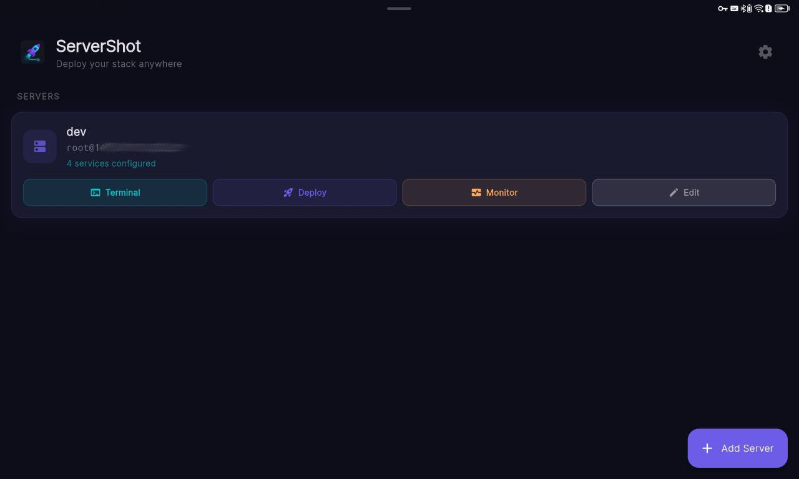
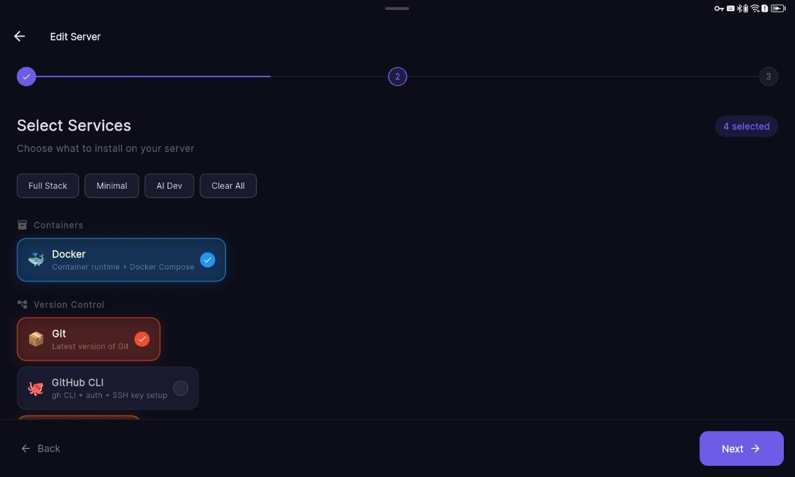
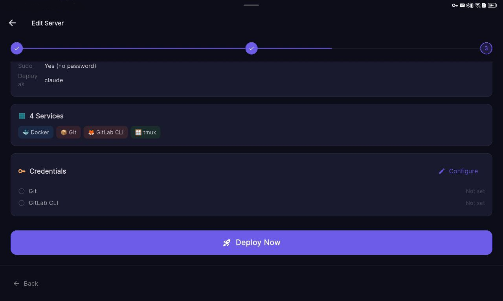
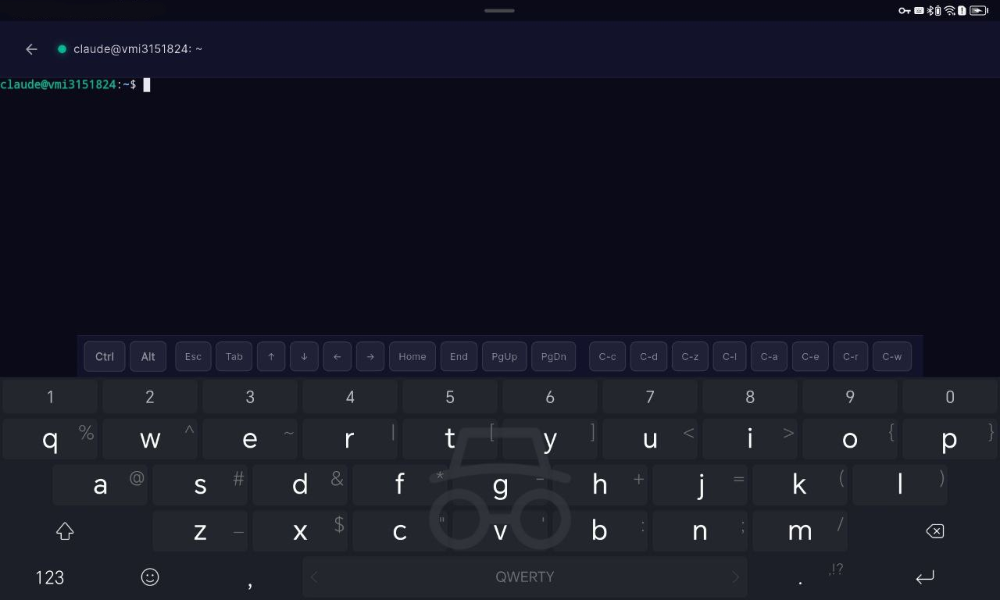
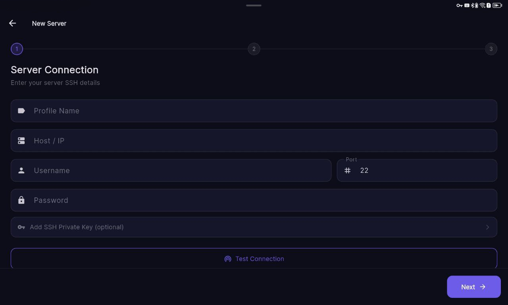
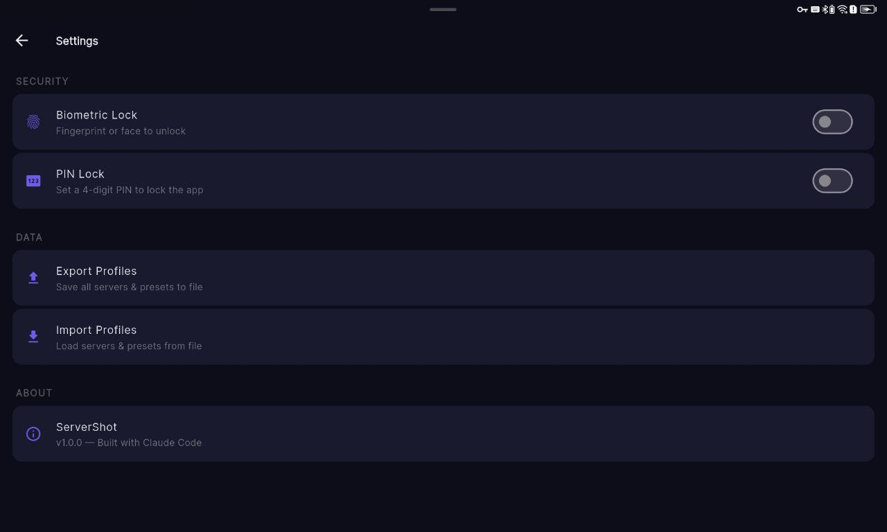

# ServerShot

**Vibe-code from anywhere. No PC needed.**

Your Android device is now your dev workstation. Spin up a fresh Linux server, deploy your entire stack with one tap — Claude Code, Git, Docker, languages, databases — and start coding through the built-in SSH terminal. From a tablet on the couch, from your phone on the train, from anywhere.

> Who needs a laptop when you have a server and ServerShot?

## What is this?

ServerShot is an Android app for developers who want to code from their phone or tablet. It connects to any Linux server via SSH, deploys a complete development environment in one tap, and gives you a full terminal to work in — including AI-powered coding with Claude Code.

**The workflow**: Rent a server → Open ServerShot → Deploy your stack → Open Terminal → Vibe-code with Claude Code → Ship from your pocket.

## Screenshots

| Home | Services | Deploy & Credentials | Terminal |
|------|----------|----------------------|----------|
|  |  |  |  |

| Connection | Settings |
|------------|----------|
|  |  |

## Features

### One-Tap Deployment
Select the tools you need, enter your credentials, hit Deploy. Watch real-time terminal output as everything installs.

### 15 Services Out of the Box
| Category | Services |
|----------|----------|
| Containers | Docker + Docker Compose |
| Version Control | Git, GitHub CLI (auto SSH key + auth), GitLab CLI |
| Languages | Node.js (nvm), Python, Go, Rust, Ruby (rbenv) |
| Dev Tools | Claude Code (native installer + Max/Pro OAuth) |
| Editors | Neovim |
| Shell | Zsh + Oh My Zsh (with plugins), tmux |
| Networking | Tailscale, Caddy |
| Databases | PostgreSQL, Redis |

### Cross-Platform
Scripts auto-detect your distro and use the right package manager. Supports Ubuntu, Debian, Fedora, CentOS, RHEL, Arch, Alpine, openSUSE.

### Smart Credentials
- **GitHub**: Enter your PAT — auto-authenticates `gh`, generates SSH key, uploads it to your GitHub profile. No manual setup.
- **Claude Code**: Paste your OAuth token from `claude setup-token` — works with Max/Pro subscription. No API key billing.
- **Tailscale**: Auth key — auto-joins your tailnet.
- **PostgreSQL**: Set the postgres password during install.
- **Global Presets**: Save credential sets and reuse across servers. No re-entering the same API keys.

### SFTP File Manager
Built-in file browser for your server:
- Navigate directories, upload files from your device, download to your device
- Create folders, delete files/dirs, progress bar for transfers
- File type icons (code, images, archives, etc.)

### Built-in SSH Terminal
Full terminal emulator powered by [xterm.dart](https://github.com/TerminalStudio/xterm.dart):
- Real VT100/ANSI rendering — vim, nano, htop, Claude Code all work
- Native clipboard paste (Ctrl+V, Ctrl+Shift+V, Paste button) via [super_clipboard](https://pub.dev/packages/super_clipboard)
- Virtual key bar: Ctrl, Alt, Esc, Tab, arrows, Home/End, PgUp/PgDn, common Ctrl combos
- USB & Bluetooth keyboard support
- Auto-reconnect with exponential backoff on disconnect
- Resumes connection when app returns to foreground
- Keep-alive every 10 seconds
- User picker — choose which user to connect as

### User Management
- **Create Deploy User**: Connect as root, create a non-root user with sudo (passwordless or with password), deploy everything under that user.
- **Custom SSH Users**: Add as many users as you want for quick terminal access.
- **SSH Key Auth**: Paste your private key (PEM) for key-based authentication.
- **Save without deploying**: Just add a server and its users, use Terminal whenever you need.

### Server Monitoring
Real-time CPU, RAM, and Disk usage with auto-refresh. Quick health check from the home screen.

### Security
- **Encrypted Storage**: All passwords, tokens, and keys stored in Android Keystore via [flutter_secure_storage](https://pub.dev/packages/flutter_secure_storage).
- **PIN Lock**: 4-digit PIN with custom numpad — works on all devices.
- **Biometric Lock**: Fingerprint/face unlock where supported.
- **Export/Import**: Backup and restore all profiles and presets to JSON.

### Presets
One-tap presets for common stacks:
- **Full Stack** — Docker, Git, GitHub CLI, Node.js, Python, Ruby, Neovim, Zsh, tmux, PostgreSQL, Redis
- **AI Dev** — Git, GitHub CLI, Node.js, Python, Claude Code, Neovim, Zsh, tmux, Docker
- **Minimal** — Git, Docker, Node.js, Zsh

## Getting Started

### Install
Download the latest APK from [Releases](../../releases) and install on your Android device.

### Build from source
```bash
git clone https://github.com/ai-punk-lab/server-shot.git
cd server-shot
flutter pub get
flutter build apk --release
```

The APK will be at `build/app/outputs/flutter-apk/app-release.apk`.

### Create a release
```bash
git tag v1.0.0
git push origin v1.0.0
```
GitHub Actions will build the APK and create a release automatically.

## Tech Stack

- **Flutter** + **Dart**
- **dartssh2** — SSH & SFTP client in pure Dart
- **xterm.dart** — terminal emulator
- **super_clipboard** — native clipboard access
- **flutter_secure_storage** — Android Keystore encryption
- **local_auth** — biometric authentication
- **Material 3** — dark theme
- **Provider** — state management

## Architecture

```
lib/
├── main.dart                      # App entry, splash, onboarding, app lock
├── models/
│   ├── server_profile.dart        # Server config model
│   ├── service_definition.dart    # Service/tool definition model
│   └── credential_preset.dart     # Global credential preset model
├── providers/
│   └── app_provider.dart          # State management
├── screens/
│   ├── home_screen.dart           # Server list + actions
│   ├── server_setup_screen.dart   # 3-step wizard (Connection → Services → Deploy)
│   ├── credentials_screen.dart    # API keys, tokens, preset management
│   ├── deploy_screen.dart         # Live deployment with terminal output
│   ├── ssh_terminal_screen.dart   # Full SSH terminal with auto-reconnect
│   ├── sftp_screen.dart           # SFTP file manager
│   ├── server_monitor_screen.dart # CPU/RAM/Disk monitoring
│   ├── settings_screen.dart       # App lock, export/import
│   ├── onboarding_screen.dart     # First-launch intro
│   └── pin_screen.dart            # PIN lock screen
├── services/
│   ├── ssh_service.dart           # SSH connection & command execution
│   ├── deployment_service.dart    # Deployment orchestration
│   ├── service_registry.dart      # 15 service definitions + cross-platform install scripts
│   ├── storage_service.dart       # Encrypted storage (Android Keystore)
│   └── script_helpers.dart        # OS/package manager detection preamble
├── theme/
│   └── app_theme.dart             # Material 3 dark theme
└── widgets/
    ├── gradient_card.dart         # Glowing card widget
    ├── service_chip.dart          # Service selection chip
    ├── terminal_view.dart         # Deployment log viewer
    └── status_badge.dart          # Install status indicator
```

## Why?

Because you shouldn't need a $2000 laptop to write code. A $5/month server + your Android device + Claude Code = a full dev setup that works from anywhere. ServerShot makes the setup part instant.

## Vibe-Coded

This app was itself vibe-coded with [Claude Code](https://claude.ai/claude-code) — proving the point. The future of mobile development is here.

## License

MIT
